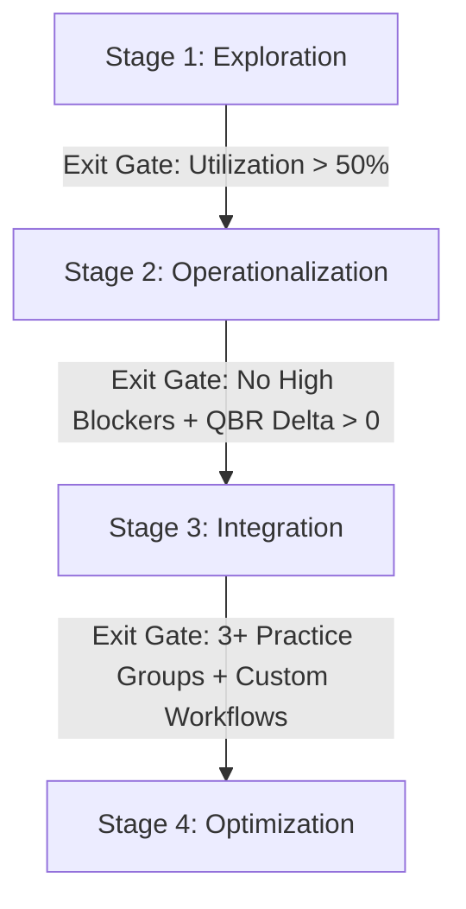

# Legal AI Adoption Maturity Model Playbook

This playbook establishes a structured framework for steering law firms and in-house teams through four progressive stages of legal-AI maturity. Use this playbook in tandem with the **Adoption Dashboard** to track, score, and advance account rollouts.

---

## The Four Stages of Maturity

---

### Stage 1: Exploration (Pilot Phase)
* **Objective:** Establish baseline trust and identify high-value candidate workflows with a small cohort of champions.
* **Dashboard Indicators:**
  - **Utilization Rate:** 10%–45% of seats active.
  - **Health Band:** `needs_attention` or `steady`.
  - **Blockers:** High severity `trust_in_output` or `training_gap` blockers are common.
* **CSM / Legal Engineer Activities:**
  - Run the **Intake & Discovery** questionnaire.
  - Execute the **30-minute Partner Briefing** to lock in primary use cases.
  - Conduct the **90-minute Associate Hands-on Clinic** to address initial verification friction.
* **Exit Gate:** 
  - [ ] Primary champion cohort demonstrates utilization > 50%.
  - [ ] At least one use case prioritizes with positive ROI savings.

---

### Stage 2: Operationalization (Practice Group Rollout)
* **Objective:** Standardize AI-assisted workflows within a full practice group and resolve day-to-day adoption friction.
* **Dashboard Indicators:**
  - **Utilization Rate:** 45%–70% of seats active.
  - **Health Band:** `steady` or `healthy`.
  - **QBR Delta:** Positive trajectory (`+5` or higher).
* **CSM / Legal Engineer Activities:**
  - Standardize saved prompt templates for the primary workflow.
  - Triage product feedback items weekly and sync with IT/Engineering on integrations.
  - Monitor WAU trends and resolve blocker spikes in secondary practice groups.
* **Exit Gate:**
  - [ ] No open High-Severity blockers for more than 14 days.
  - [ ] Blended WAU trend is stable or upward.

---

### Stage 3: Integration (System Expansion)
* **Objective:** Embed the tool into the firm’s core workflows (e.g. Document Management System integration) and scale across multiple practice groups.
* **Dashboard Indicators:**
  - **Seats Active:** > 70% of licenses utilized.
  - **Health Band:** Consistent `healthy`.
  - **QBR Delta:** Upward momentum (`+8` or higher).
* **CSM / Legal Engineer Activities:**
  - Propose license expansions (using the D2 Renewal/Expansion Timeline signals).
  - Integrate document retrieval connector pilots.
  - Compile the QBR ROI calculator data to demonstrate direct time savings to managing partners.
* **Exit Gate:**
  - [ ] Active usage spans 3+ distinct practice groups.
  - [ ] Verified integration with core document repositories.

---

### Stage 4: Optimization (Firm-Wide Standard)
* **Objective:** Institutionalize legal AI as a firm-wide competitive differentiator, optimizing ROI and legal quality.
* **Dashboard Indicators:**
  - **Seats Active:** > 85% utilization.
  - **Health Band:** Permanent `healthy` / `steady`.
  - **Blockers:** Zero high-severity blockers.
* **CSM / Legal Engineer Activities:**
  - Hold quarterly value alignment sessions with the executive committee.
  - Showcase firm-wide billable capacity savings.
  - Refine custom health weights in `health-config.json` to raise engagement standards.
* **Exit Gate:**
  - [ ] The platform is designated as the firm-wide standard for draft reviews.
  - [ ] Regular cadence of product feedback looping directly to the AI vendor.
