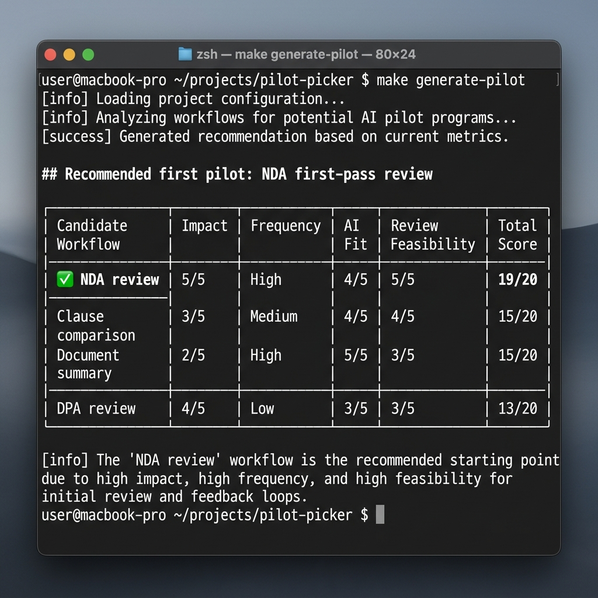
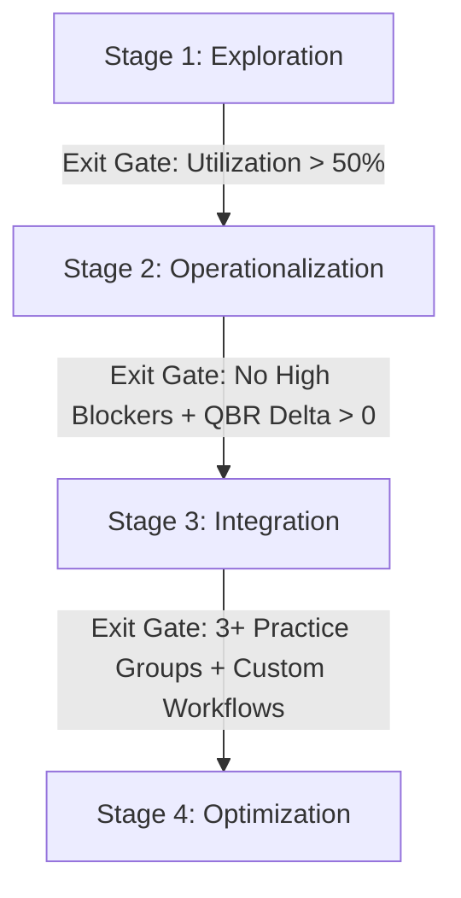

# Legal AI Workshop Kit — Unified Playbook

*This is a single unified file compiling all discovery tools, workshop agendas, and post-sales playbooks in the Legal AI Workshop Kit.*

---

## Table of Contents

- [legal-ai-workshop-kit](#readme)
- [What this proves](#what-this-proves)
- [Reviewer guide](#docs-reviewer-guide)
- [Customer workflow](#docs-customer-workflow)
- [Product-feedback notes](#docs-product-feedback-notes)
- [Adoption questionnaire](#discovery-adoption-questionnaire)
- [Workflow discovery template](#discovery-workflow-discovery-template)
- [Use-case prioritization matrix](#discovery-use-case-prioritization-matrix)
- [Legal AI ROI Calculation Worksheet](#discovery-roi-calculator)
- [30-minute partner briefing](#sessions-30-min-partner-briefing)
- [60-minute workshop agenda](#sessions-60-min-workshop-agenda)
- [90-minute associate hands-on](#sessions-90-min-associate-hands-on)
- [Legal AI Adoption Maturity Model Playbook](#enablement-adoption-maturity-model)
- [Skeptical-partner objection handling](#enablement-skeptical-partner-objections)
- [Follow-up email templates](#enablement-follow-up-email-templates)
- [Product-feedback template](#enablement-product-feedback-template)

---

<div id="readme">


## legal-ai-workshop-kit


See [CASE_STUDY.md](../CASE_STUDY.md) for the problem, controls, and limitations, and [TEAM_PLAYBOOK.md](../TEAM_PLAYBOOK.md) for the team operating guidelines.

Enablement materials for legal AI: partner briefings, associate hands-on, adoption questionnaires, workflow discovery. Not legal advice; data is synthetic.

**Public-safety posture:** synthetic workshop materials only, source provenance for assumptions and feedback, explicit lawyer review gates, and no legal advice.

> **If you don't code:** scroll to [What the demo produces](#what-the-demo-produces). This repo ships a sample output you can read in the browser. The point isn't the code; it's whether the legal work is structured, cited, reviewable, and testable.



## Run it

```bash
git clone https://github.com/sebastianfoerste/legal-ai-workshop-kit
cd legal-ai-workshop-kit
make generate-pilot
```

Runs end to end, offline and deterministically.

## What the demo produces

The demo scores candidate workflows through the prioritization matrix and outputs the recommended first pilot based on impact, frequency, AI fit, and review feasibility. You can read the committed sample output: [`examples/workshop-outcome.md`](../examples/workshop-outcome.md).

```markdown
# Sample output: prioritization result

| Candidate workflow | Impact | Frequency | AI fit | Review feasibility | Total |
|---|---:|---:|---:|---:|---:|
| NDA first-pass review | 4 | 5 | 5 | 5 | **19** |
| Clause comparison across versions | 4 | 4 | 5 | 5 | **18** |
| Document / issue summary | 3 | 5 | 4 | 4 | **16** |
```

In the sample run, the matrix turns a demo into a prioritised adoption plan, not a one-off session.

## Pilot-to-adoption path

This is the Harvey / Legora reviewer path:

1. **Onboarding:** scope the team with the adoption questionnaire and workflow discovery template.
2. **Blocker diagnosis:** use the prioritization matrix to separate high-value workflows from low-review-feasibility demos.
3. **Workshop follow-up:** run the partner briefing, 60-minute workshop, or 90-minute associate hands-on based on the blocker.
4. **Product feedback:** convert observed friction into a structured product-feedback note for Engineering and Product.
5. **Usage trend:** re-baseline adoption with the maturity model and first 90 days deployment plan.

## What it checks / does

| Document / Tool | Focus | Verification Method |
|---|---|---|
| Discovery Questionnaire | Readiness check | Assesses Firm/Team operational and technological readiness |
| Prioritization Matrix | Use-case ranking | Evaluates workflows against feasibility and business impact |
| Product-Feedback Template | Product improvement | Translates user friction observed in workshops into requirements |

---

> **What workflow does this improve?** Onboarding and enablement: getting partners, associates, and in-house counsel actually using legal AI after the contract is signed.
> **Who is the user?** A Legal Engineer, CSM, or Innovation lead running the rollout.
> **Where does human review happen?** Every agenda and template keeps the rule explicit: AI produces a first pass, a named lawyer signs off before reliance.
> **What is blocked until approval?** Nothing ships to a court or client on AI output alone. The kit teaches the review gate, it does not remove it.
> **What would I tell Product?** The product-feedback template turns what you observe in sessions into structured requirements for Engineering.

## Problem

Adoption does not fail at procurement. It fails in the first ninety days, when a workshop
never gets booked, a skeptical partner is never answered, and the friction associates hit
never reaches Product. This kit is the operating system for that ninety days: what to run,
in what order, with whom, and what to do with what you learn.

## Who runs this

A Legal Engineer or CSM owning the rollout. The kit assumes you are not the lawyer of
record and not the engineer; you are the person who makes the tool stick.

## What's inside

| Document | Use it when |
| --- | --- |
| [60-minute workshop agenda](#sessions-60-min-workshop-agenda) | You have a practice group for an hour and want them using the tool by the end. |
| [30-minute partner briefing](#sessions-30-min-partner-briefing) | You have a partner's calendar for half an hour and need a go/no-go decision. |
| [90-minute associate hands-on](#sessions-90-min-associate-hands-on) | You want associates to build real fluency on synthetic documents. |
| [Adoption questionnaire](#discovery-adoption-questionnaire) | You are scoping an account and need to score its readiness. |
| [Workflow discovery template](#discovery-workflow-discovery-template) | You are mapping a real workflow to a candidate AI use case. |
| [Use-case prioritization matrix](#discovery-use-case-prioritization-matrix) | You have a list of candidate use cases and need to pick what to pilot first. |
| [ROI & value worksheet](#discovery-roi-calculator) | You need a worksheet to calculate hours saved and direct financial ROI. |
| [Skeptical-partner objections](#enablement-skeptical-partner-objections) | A partner is pushing back and you need an evidence-based answer, fast. |
| [Follow-up email templates](#enablement-follow-up-email-templates) | A session just ended, or usage dipped, and you need to send the right note. |
| [Product-feedback template](#enablement-product-feedback-template) | You watched a user hit friction and want to turn it into a product requirement. |
| [Adoption maturity model](#enablement-adoption-maturity-model) | You need a structured framework to map dashboard metrics to rollout stages. |
| [First 90 days deployment plan](first-90-days-deployment-plan.md) | You are forward-deployed and need a measurable day-1-to-90 rollout sequence. |
| [Unified Playbook (Markdown)](workshop-kit-unified.md) / [HTML](workshop-kit-unified.html) | You want a single compiled document for review containing all assets. |
| [Customer workflow](#docs-customer-workflow) | You need the standard context on the typical customer workflow. |
| [Product-feedback notes](#docs-product-feedback-notes) | You need the standard repository file for worked product feedback examples. |
| [Reviewer guide](#docs-reviewer-guide) | You need the standard guidance for reviewing these artifacts. |

Also includes an [example intake](../examples/synthetic-input.json) with its [prioritization result](../examples/sample-output.md).

## How to use it in a rollout

1. Scope the account with the adoption questionnaire and a few workflow-discovery sessions.
2. Rank candidate use cases with the prioritization matrix; pick one to pilot.
3. Run the partner briefing for the go decision, then the workshop for the group, then the associate hands-on for fluency.
4. Capture friction with the product-feedback template; send the right follow-up.
5. Re-baseline and expand.

## Data statement

All examples are generic or synthetic. No real client, firm, matter, or personal data
appears anywhere in this repo. Merge fields in the email templates use `{{double_brace}}`
placeholders you replace per engagement.

## Check

`make check` verifies every required document exists and that none is left half-written.
It is the only automated gate in this repo.


</div>

---

<div id="what-this-proves">


## What this proves


Building a legal-AI tool is one job. Getting a skeptical partnership to actually use it is a
different one, and it is the one the post-sales / Legal Engineer role is really about. This
repo is the evidence for the second job.

| Document | Responsibility it demonstrates |
| --- | --- |
| [60-minute workshop agenda](#sessions-60-min-workshop-agenda) | Running enablement that ends in committed workflows, not applause. |
| [30-minute partner briefing](#sessions-30-min-partner-briefing) | Making the economic and risk case to a decision-maker in their register. |
| [90-minute associate hands-on](#sessions-90-min-associate-hands-on) | Building real user fluency, with verification as the core skill. |
| [Adoption questionnaire](#discovery-adoption-questionnaire) | Scoring account readiness before spending time — predicting blockers early. |
| [Workflow discovery template](#discovery-workflow-discovery-template) | Mapping real work to AI use cases, with verification cost as a first-class field. |
| [Use-case prioritization matrix](#discovery-use-case-prioritization-matrix) | Sequencing pilots for trust first, ambition second. |
| [Skeptical-partner objections](#enablement-skeptical-partner-objections) | Handling resistance with evidence and the review gate, not hype. |
| [Follow-up email templates](#enablement-follow-up-email-templates) | Re-engagement and expansion at the right moment, in the right words. |
| [Product-feedback template](#enablement-product-feedback-template) | Translating field friction into structured requirements for Engineering. |

The through-line: every artifact keeps the human-review gate explicit and treats trust as
the thing to earn first. That is what makes legal AI adoptable inside a regulated practice,
and it is the judgment the role is hiring for.


</div>

---

<div id="docs-reviewer-guide">


## Reviewer guide


A five-minute path for a reviewer who is not going to read every document.

1. **Start at the [README](#readme).** The "What's inside" table is the map — each
   document says when you would reach for it.
2. **Open the [60-minute workshop agenda](#sessions-60-min-workshop-agenda).** It shows
   how a session is run: it ends in committed workflows and keeps the review gate on screen
   the whole hour. This is the core deliverable.
3. **Open the [product-feedback template](#enablement-product-feedback-template).** Read
   the worked example. This is the artifact that turns what you see in a session into a
   requirement Engineering can act on — the skill the role is screening for.
4. **Skim the [prioritization matrix](#discovery-use-case-prioritization-matrix).** Note
   the floor rule: never pilot a workflow you cannot cheaply verify, regardless of impact.
   That single rule captures the trust-first judgment behind the whole kit.

What to check: the content is usable as-is, the human-review gate is explicit everywhere,
and nothing frames the tool as replacing a lawyer.

Run `make check` to confirm every document is present and none is left half-written.


</div>

---

<div id="docs-customer-workflow">


## Customer workflow


How the kit is used end to end across the life of an account.

## Scope (week 0)
Run the [adoption questionnaire](#discovery-adoption-questionnaire) with the account.
Score the five sections. A low section is not a stop; it is the first work item — usually
champion time or a data path. Do not book a workshop into an account that scores in the
hold band.

## Discover (weeks 0–2)
Fill a [workflow discovery template](#discovery-workflow-discovery-template) for each
candidate workflow with the group. The two fields that decide fit are frequency and
verification cost. A workflow that is rare or expensive to check is a poor first pilot
however appealing it sounds.

## Prioritize (week 2)
Score the candidates in the [prioritization matrix](#discovery-use-case-prioritization-matrix).
Apply the floor rule and pick one workflow to pilot. Sequence for trust: frequent and
easy to verify beats high-impact and hard to verify.

## Decide (week 2)
Run the [partner briefing](#sessions-30-min-partner-briefing). The output is a
sponsored four-week pilot with a named workflow and a workshop date, or a clear no.

## Enable (weeks 3–4)
Run the [workshop](#sessions-60-min-workshop-agenda) for the group, then the
[associate hands-on](#sessions-90-min-associate-hands-on) for fluency. Both end in
committed workflows and a captured friction log.

## Sustain (ongoing)
Watch usage. When it dips, the cause is usually a specific blocker — workflow fit, training,
or trust. Send the re-engagement note from the
[follow-up templates](#enablement-follow-up-email-templates) that names the likely
cause, and fix it. Log every friction point with the
[product-feedback template](#enablement-product-feedback-template).

## Expand (when earned)
When usage is a habit and the group asks for more, send the expansion note. Repeat the
cycle for the next workflow or group. Expansion is earned on a real usage signal, never
pushed on a calendar.

Throughout: the human-review gate never moves. The kit teaches adoption of a reviewed
product; it never removes the lawyer's sign-off.


</div>

---

<div id="docs-product-feedback-notes">


## Product-feedback notes


A worked example of the step that matters most: three observations from one workshop,
turned into requirements Engineering can act on. Each uses the
[product-feedback template](#enablement-product-feedback-template).

## Observation 1 — missed cross-referenced definition
**Seen:** a Corporate associate, NDA first-pass review. The tool extracted the
confidentiality clause but missed that an earlier definition section changed what
"Confidential Information" meant.
**Class:** trust. A missed definition changes the risk read.
**Requirement:** resolve cross-referenced definitions before extraction and attach the
controlling definition to the extracted clause.
**Acceptance:** on a document where a definition modifies a later clause, the extracted
clause shows the controlling definition without the reviewer hunting for it.
**Priority:** highest — trust-touching, and it hits the most frequent corporate workflow.

## Observation 2 — US-style drafting register
**Seen:** an in-house counsel, drafting. The output read as US-style boilerplate on a
German-law contract.
**Class:** fit. Not wrong, but unusable without a rewrite.
**Requirement:** a jurisdiction setting that switches the drafting register and the review
checklist.
**Acceptance:** under a German-law profile, the draft drops US boilerplate and uses the
local register.
**Priority:** high for in-house accounts in the DACH region; lower elsewhere.

## Observation 3 — no usage export
**Seen:** an Innovation lead, planning a wider rollout. Wanted last-quarter usage by group
and could not get it without asking us.
**Class:** convenience, but it blocks a champion's own planning.
**Requirement:** a self-serve export of per-group usage and trend.
**Acceptance:** an Innovation lead pulls last-quarter active users by group without a
support request.
**Priority:** medium — cheap, and it turns a champion into an advocate.

## The pattern to take to Engineering
Sequence by class, not by volume of complaints: ground first (Observation 1), fit second
(Observation 2), convenience third (Observation 3). Trust-touching items are a different
class of problem and jump the queue.


</div>

---

<div id="discovery-adoption-questionnaire">


## Adoption questionnaire


**Use this when** you are scoping an account and need a readiness score before you commit
workshop time.

Score each question, total by section, and read the band at the end. The five sections map
to the same signals the adoption dashboard tracks — champion, workflow pain, data
constraints, prior experience, and sponsorship — so a low section here predicts a blocker
later.

Scoring: **0** = no / not present, **1** = partial, **2** = yes / strong.

## 1. Champion (max 6)
- Is there a named Innovation lead or PSL who owns this rollout? ___
- Does that person have time allocated, not just the title? ___
- Can they get a partner on the phone when needed? ___

A low score here is the single best predictor of a stall. No champion, no adoption.

## 2. Workflow pain (max 6)
- Is there a high-frequency task the group already complains about? ___
- Does that task have a clear first-pass-then-review shape? ___
- Is the pain felt by associates, who will actually use the tool, not only by partners? ___

Pain the users feel is what pulls a tool into daily use. Pain only partners feel does not.

## 3. Data and confidentiality constraints (max 6)
- Is there an approved environment that keeps client data out of untrusted systems? ___
- Are the relevant confidentiality and privilege constraints already mapped? ___
- Can the group identify synthetic or non-confidential documents to train on? ___

A zero in this section is not a disqualifier; it is the first work item.

## 4. Prior AI experience (max 6)
- Has the group used any AI tool before, even informally? ___
- Did that experience leave trust intact, or burned? ___
- Is there realistic expectation-setting, rather than either hype or dismissal? ___

A burned prior experience scores low and changes the rollout: lead with the review gate and
small wins, not capability claims.

## 5. Sponsorship and economics (max 6)
- Is a partner willing to sponsor a pilot, not just permit one? ___
- Is there a reason the economics matter to them now — leverage, write-offs, cycle time? ___
- Will someone be measured on whether this works? ___

## Reading the score (max 30)
- **24–30 — ready.** Book the partner briefing and a workshop. Expect fast adoption.
- **16–23 — ready with gaps.** Close the lowest section first. Usually champion time or a data path.
- **8–15 — not yet.** One or two foundations are missing. Do the groundwork before spending workshop time.
- **0–7 — hold.** No champion, no pain, no sponsor. A workshop here will not stick.

Record the section scores, not just the total. The dashboard reads blockers by category,
and a low section here is the category that will show up there.


</div>

---

<div id="discovery-workflow-discovery-template">


## Workflow discovery template


**Use this when** you are mapping a real workflow to a candidate AI use case, so the pilot
targets something that matters and can actually be reviewed.

Fill one of these per candidate workflow. The fields force the two questions that decide
whether a workflow is a good fit: how often does it happen, and how cheaply can a human
verify the output.

## Template

- **Workflow name:** `{{name}}`
- **Practice group:** `{{group}}`
- **Trigger:** what starts this work? (a signed engagement, an inbound contract, a filing)
- **Inputs:** what documents or facts come in?
- **Current steps:** the sequence today, who does each step.
- **Time cost:** rough hours per instance, and who spends them.
- **Frequency:** how often per week or month, across the group.
- **Mandatory review point:** where must a qualified lawyer review before anything is relied on or sent? This never moves.
- **Candidate AI step:** which single step becomes a first pass the AI produces and a human checks?
- **Verification cost:** how long does it take a human to confirm the AI output is right? If the answer is "as long as doing it from scratch," this is a poor fit.
- **Confidentiality note:** can this run in the approved environment, and is there a synthetic version for training?

## Worked example (synthetic)

- **Workflow name:** NDA first-pass review
- **Practice group:** Corporate
- **Trigger:** an inbound NDA arrives ahead of a deal conversation.
- **Inputs:** the counterparty's NDA, the firm's NDA playbook.
- **Current steps:** paralegal logs it; associate reads it against the playbook; associate marks deviations; partner reviews the marked-up version.
- **Time cost:** ~45 minutes of associate time per NDA.
- **Frequency:** 10–15 per week across the group.
- **Mandatory review point:** partner sign-off on the marked-up NDA before it goes back to the counterparty. Unchanged.
- **Candidate AI step:** the associate's first pass — extract clauses, compare to the playbook, flag deviations — becomes an AI first pass the associate verifies.
- **Verification cost:** ~10 minutes to check flagged clauses against the text. Much less than the 45 minutes from scratch. Good fit.
- **Confidentiality note:** runs in the approved environment; a synthetic NDA set exists for the workshop.

This example scores well because it is frequent, the review point is clear, and
verification is far cheaper than the original task. Carry the filled template into the
prioritization matrix.


</div>

---

<div id="discovery-use-case-prioritization-matrix">


## Use-case prioritization matrix


**Use this when** you have several candidate workflows and need to pick what to pilot
first — on evidence, not on whoever lobbied loudest.

Score each candidate 1–5 on four dimensions. Total out of 20. Then apply the floor rule.

## Dimensions

- **Impact** — time saved per instance times the value of the work. A partner-facing summary scores higher than an internal note.
- **Frequency** — how often the task recurs across the group. Daily beats quarterly.
- **AI fit** — how well current models handle this task today, honestly assessed.
- **Review feasibility** — how cheaply a human can verify the output. High means a quick claim-to-source check; low means re-doing the work to trust it.

## Worked example (synthetic)

| Candidate workflow | Impact | Frequency | AI fit | Review feasibility | Total |
|---|---:|---:|---:|---:|---:|
| NDA first-pass review | 4 | 5 | 5 | 5 | **19** |
| Clause comparison across versions | 4 | 4 | 5 | 5 | **18** |
| Document / issue summary | 3 | 5 | 4 | 4 | **16** |
| DPA review (GDPR) | 4 | 3 | 3 | 3 | **13** |
| Litigation research memo | 5 | 3 | 3 | 2 | **13** |

## The floor rule

Pick the highest total — **but never pilot a workflow scoring below 4 on Review
feasibility**, no matter how high its impact.

In the example, the litigation research memo ties on total and scores highest on impact,
but its review feasibility is 2: the output is hard and slow to verify, and a missed
fabricated citation is a serious error. It is the wrong first pilot. Lead with the **NDA
first-pass review** instead — frequent, well-handled, and cheap to check. Win trust on
something verifiable before taking on the work that is expensive to review.

## Why this order matters for adoption

The first pilot sets the trust narrative for the whole account. A workflow that is frequent
and easy to verify produces visible wins and few scares. A high-impact but
hard-to-verify workflow produces the opposite, and one bad citation early can end the
rollout. Sequence for trust first, ambition second.


</div>

---

<div id="discovery-roi-calculator">


## Legal AI ROI Calculation Worksheet


This worksheet provides Customer Success Managers (CSMs) and Legal Engineers with a standardized, data-backed framework to calculate the economic impact and return on investment (ROI) of legal-AI rollouts ahead of QBRs and renewal conversations.

---

## 1. Key Value Metrics & Formulas

To compute the direct value realized by a practice group, we measure the frequency of tasks and the net duration delta between manual processing and AI-assisted drafting/verification.

### Formula A: Weekly Time Saved (Hours)
$$\text{Hours Saved/Week} = \frac{\text{Weekly Frequency} \times (\text{Manual Baseline Duration (mins)} - \text{AI Verification Duration (mins)})}{60}$$

### Formula B: Annual Direct Value ($)
$$\text{Annual Direct Value} = \text{Weekly Hours Saved} \times 52 \text{ weeks} \times \text{Blended Billable Rate}$$

*Note: Use a blended associate billable rate (typically \$300–\$450 depending on firm tier and region) to represent the billable capacity freed up for strategic client work.*

### Formula C: Net Value & ROI
$$\text{Net Annual Value} = \text{Annual Direct Value} - \text{Annual Software License Cost}$$
$$\text{ROI (\%)} = \left( \frac{\text{Net Annual Value}}{\text{Annual Software License Cost}} \right) \times 100$$

---

## 2. Sample Calculation Table (Corporate & Litigation Rollouts)

Below is an economic model based on typical usage inputs (calibrated against `examples/synthetic-input.json` and the dashboard practice groups):

| Practice Group | Target Workflow | Weekly Volume | Manual Time | Verification Time | Net Time Saved | Weekly Hours Saved | Annual Direct Value (@\$350/hr) |
|---|---|---:|---:|---:|---:|---:|---:|
| **Corporate** | NDA first-pass review | 12.5 | 45 min | 10 min | 35 min | 7.3 hrs | \$132,860 |
| **Litigation** | Research memo draft | 3.5 | 180 min | 90 min | 90 min | 5.3 hrs | \$96,460 |
| **Corporate** | Version clause compare | 9.0 | 30 min | 8 min | 22 min | 3.3 hrs | \$60,060 |
| **Corporate** | DPA review (GDPR) | 3.5 | 60 min | 25 min | 35 min | 2.0 hrs | \$36,400 |
| **Total Portfolio** | | **28.5** | | | | **17.9 hrs** | **\$325,780** |

### Annual Economic Return Summary
- **Total Hours Saved per Year:** 930.8 hours
- **Annual Direct Value (Re-allocated Capacity):** \$325,780
- **Assumed Annual License Cost (e.g., 50 seats):** \$75,000
- **Net Annual Value:** \$250,780
- **Total Portfolio ROI:** **334.4%**

---

## 3. Playbook: Leveraging ROI in Renewal Conversations

When preparing for a renewal or seat-expansion discussion, present this worksheet alongside the **Account Health Dashboard** statistics:

1. **Reconcile with Utilization Data:** Match the "Weekly Volume" in this worksheet with the active queries and weekly active user counts shown on the dashboard homepage.
2. **Handle Partner Skepticism Proactively:** If a partner questions the value, frame the time savings as "recovered capacity." Instead of cutting associate heads, emphasize that associates saved **17.9 hours per week** which was re-allocated to high-value briefing memos and client deal strategy.
3. **Link to Blocker Mitigation:** If blockers (e.g., `trust_in_output`) were resolved during the quarter, show how resolving that blocker (e.g., via a citation grounding clinic) unlocked the corresponding practice group's ROI in the table above.


</div>

---

<div id="sessions-30-min-partner-briefing">


## 30-minute partner briefing


**Use this when** you have a partner's calendar for half an hour and need a go/no-go
decision on rolling the tool into their group.

**Outcome:** the partner makes one decision — sponsor a pilot in their group, or not — with
the economics and the risk posture clear. No live demo unless they ask; this is a business
conversation, not a tool tour.

**Audience register:** executive. Short sentences. No technical detail. Lead with the
number, end with the ask.

---

## 0:00–0:08 — The business case

Three numbers, framed in their terms:

- **Leverage.** First-pass review and drafting move down a level. A partner's time shifts from producing the draft to reviewing it. The group bills the same work at a better mix.
- **Utilization.** The tasks that get written off — the short turnarounds that never make the bill — become economic again when the first pass takes minutes.
- **Cycle time.** Matters that waited on associate capacity move faster, which clients notice at renewal.

State the one that matters most to this partner first. For a rainmaker, cycle time. For a
managing partner, leverage and write-offs.

## 0:08–0:16 — What changes in their workflow

Be concrete about the day:

- The associate's first pass arrives in minutes, not the next morning.
- The partner's job becomes review, not redrafting from a blank page.
- The work product that reaches the partner already carries its sources, so review is checking, not reconstructing.

Name what does not change: the partner still owns the advice, still signs off, still
carries the judgment. The tool changes who produces the draft, not who is responsible for it.

## 0:16–0:24 — Risk and confidentiality posture

Answer the two questions a partner always has, before they ask:

- **Confidentiality.** No client data goes into an untrusted system. The rollout uses the approved environment, and the workshops run on synthetic documents. Spell out the data path in one sentence.
- **Reliability.** Every output passes a human-review gate before reliance. The tool produces a first pass; a named lawyer checks each claim against its source and signs off. A wrong citation is caught at review, not at filing.

If the firm has a professional-responsibility or risk committee, name that this rollout is
consistent with its guidance, or that you will route it there first.

## 0:24–0:30 — The decision ask

One ask: sponsor a four-week pilot in your group. That means naming one workflow, letting
us run a workshop and an associate session, and a fifteen-minute check-in at the end. If
the pilot does not earn its place, we stop.

Leave with a yes/no and, on yes, a named workflow and a date for the workshop.

---

## Briefing notes
- Do not open the tool unless the partner asks. The decision is economic and professional, not technical.
- If the partner raises a specific objection, switch to the objection-handling guide and answer it directly, then return to the ask.
- The output of this meeting is a sponsored pilot with a named workflow and a date. Anything vaguer is a soft no.


</div>

---

<div id="sessions-60-min-workshop-agenda">


## 60-minute workshop agenda


**Use this when** you have a practice group for an hour and want them using the tool on
their own work by the end.

**Outcome:** every attendee runs one real task end to end, sees where the human-review gate
sits, and leaves with one workflow they commit to trying that week.

**Room setup:** attendees on laptops with access provisioned in advance. One facilitator
(Legal Engineer or CSM). One practice-group sponsor in the room who will be named on the
follow-up. Synthetic documents loaded so nobody pastes a live matter.

---

## 0:00–0:05 — Framing

**Leads:** facilitator.
**Objective:** set the rule before the tool. State plainly: the AI produces a first pass;
a named lawyer reviews and signs off before anything is relied on or sent. Adoption is
measured by useful first passes, not by replaced judgment.
**Artifact:** one slide with the review-gate rule, left on screen for the hour.

## 0:05–0:25 — One live use case for this group

**Leads:** facilitator, with the sponsor narrating the real workflow.
**Objective:** run the single highest-frequency task this group actually does — NDA
first-pass review for corporate, clause comparison for finance, document summary for
litigation — against a synthetic document, live, on the screen.
**How:** facilitator drives once; then attendees repeat it on their own laptops with a
second synthetic document. Stop at the point where a lawyer would normally review.
**Artifact:** each attendee has produced one first-pass output.

## 0:25–0:35 — Where the review gate sits

**Leads:** facilitator.
**Objective:** show the failure modes before trust is assumed. Walk one output that looks
right and one that contains a wrong citation. Teach the two checks every output gets:
does each claim trace to the source, and would you put your name on it.
**Artifact:** a shared one-page checklist (claim-to-source, name-on-it) attendees keep.

## 0:35–0:50 — Hands-on, their own task

**Leads:** attendees; facilitator circulates.
**Objective:** each attendee picks one recurring task from their week and runs it on a
synthetic or non-confidential version. The facilitator helps phrase the request and points
out where the output needs a human pass.
**Artifact:** each attendee names one task they will run for real this week.

## 0:50–1:00 — Commitments and next steps

**Leads:** facilitator and sponsor.
**Objective:** convert the hour into a plan. Each attendee states their one committed
workflow. The sponsor agrees to a two-week check-in. The facilitator notes any friction
raised, for the product-feedback template and the follow-up email.
**Artifact:** a list of committed workflows by name, a booked check-in, and a friction log.

---

## Facilitator notes
- Keep the review-gate slide visible the entire hour. It is the message that makes the tool adoptable in a regulated practice.
- Never let an attendee paste a live matter. Have synthetic documents ready and say why.
- The commitments at the end are the real output. A workshop with no named next task does not move adoption.
- Capture friction verbatim during the hands-on block; it feeds the product-feedback template the same day.


</div>

---

<div id="sessions-90-min-associate-hands-on">


## 90-minute associate hands-on


**Use this when** you want associates to build real fluency — not a demo, but supervised
practice on synthetic documents until the workflow is theirs.

**Outcome:** each associate completes three guided tasks, learns to spot a hallucinated
citation, and leaves able to run the workflow unsupervised the next day.

**Setup:** associates on laptops, access provisioned. Synthetic documents loaded. One
facilitator. The session is hands-on throughout; the facilitator demonstrates once per task,
then associates work and the facilitator circulates.

---

## 0:00–0:10 — Setup and the one rule

Confirm everyone has access and the synthetic document set. State the rule that governs the
whole session and the job: the AI produces a first pass, the associate verifies every claim
against the source, and a supervising lawyer signs off before the work is used. The
associate's new skill is not prompting — it is fast, reliable review.

## 0:10–0:35 — Task 1: First-pass NDA review

**Input:** a synthetic mutual NDA.
**What to do:** ask the tool to extract the key clauses and flag anything unusual.
**Expected output:** a clause list with risk flags — for example, a perpetual confidentiality
term flagged as high.
**Review step:** for each flagged clause, the associate opens the NDA and confirms the
quoted text actually appears and the flag is fair. Any flag that cannot be traced to the
text is struck.

## 0:35–1:00 — Task 2: Clause comparison across versions

**Input:** two synthetic versions of the same agreement.
**What to do:** ask the tool for the substantive differences, not the cosmetic ones.
**Expected output:** a short list of changed obligations — a liability cap that moved, a
notice period that shortened.
**Review step:** the associate verifies each reported change against both documents and
confirms nothing material was missed by spot-checking one section the tool did not mention.

## 1:00–1:20 — Task 3: Issue summary for a partner

**Input:** a synthetic memo or set of facts.
**What to do:** ask for a one-paragraph issue summary a partner could read in thirty seconds.
**Expected output:** a tight summary with the open question stated.
**Review step:** the associate checks that every assertion is supported and rewrites in the
firm's register before it would go anywhere near a partner.

## 1:20–1:30 — Spot the hallucination, and capture friction

**Spot it:** the facilitator hands out one pre-made output containing a fabricated citation.
Associates race to find it and explain how they caught it. This drills the claim-to-source
check until it is reflex.
**Capture friction:** each associate names the one thing that slowed them down. The
facilitator logs it for the product-feedback template.

---

## Facilitator notes
- Demonstrate each task once, then get out of the way. Fluency comes from doing, not watching.
- The spot-the-hallucination drill is the most important ten minutes. An associate who cannot catch a bad citation is not ready to use the tool unsupervised.
- Every task ends on a review step on purpose. The habit you are building is verification, not generation.
- The friction captured here is the highest-signal product feedback you will get; route it the same day.


</div>

---

<div id="enablement-adoption-maturity-model">


## Legal AI Adoption Maturity Model Playbook


This playbook establishes a structured framework for steering law firms and in-house teams through four progressive stages of legal-AI maturity. Use this playbook in tandem with the **Adoption Dashboard** to track, score, and advance account rollouts.

---

## The Four Stages of Maturity



---

### Stage 1: Exploration (Pilot Phase)
* **Objective:** Establish baseline trust and identify high-value candidate workflows with a small cohort of champions.
* **Dashboard Indicators:**
  - **Utilization Rate:** 10%–45% of seats active.
  - **Health Band:** `needs_attention` or `steady`.
  - **Blockers:** High severity `trust_in_output` or `training_gap` blockers are common.
* **CSM / Legal Engineer Activities:**
  - Run the **Intake & Discovery** questionnaire.
  - Execute the **30-minute Partner Briefing** to lock in primary use cases.
  - Conduct the **90-minute Associate Hands-on Clinic** to address initial verification friction.
* **Exit Gate:** 
  - [ ] Primary champion cohort demonstrates utilization > 50%.
  - [ ] At least one use case prioritizes with positive ROI savings.

---

### Stage 2: Operationalization (Practice Group Rollout)
* **Objective:** Standardize AI-assisted workflows within a full practice group and resolve day-to-day adoption friction.
* **Dashboard Indicators:**
  - **Utilization Rate:** 45%–70% of seats active.
  - **Health Band:** `steady` or `healthy`.
  - **QBR Delta:** Positive trajectory (`+5` or higher).
* **CSM / Legal Engineer Activities:**
  - Standardize saved prompt templates for the primary workflow.
  - Triage product feedback items weekly and sync with IT/Engineering on integrations.
  - Monitor WAU trends and resolve blocker spikes in secondary practice groups.
* **Exit Gate:**
  - [ ] No open High-Severity blockers for more than 14 days.
  - [ ] Blended WAU trend is stable or upward.

---

### Stage 3: Integration (System Expansion)
* **Objective:** Embed the tool into the firm’s core workflows (e.g. Document Management System integration) and scale across multiple practice groups.
* **Dashboard Indicators:**
  - **Seats Active:** > 70% of licenses utilized.
  - **Health Band:** Consistent `healthy`.
  - **QBR Delta:** Upward momentum (`+8` or higher).
* **CSM / Legal Engineer Activities:**
  - Propose license expansions (using the D2 Renewal/Expansion Timeline signals).
  - Integrate document retrieval connector pilots.
  - Compile the QBR ROI calculator data to demonstrate direct time savings to managing partners.
* **Exit Gate:**
  - [ ] Active usage spans 3+ distinct practice groups.
  - [ ] Verified integration with core document repositories.

---

### Stage 4: Optimization (Firm-Wide Standard)
* **Objective:** Institutionalize legal AI as a firm-wide competitive differentiator, optimizing ROI and legal quality.
* **Dashboard Indicators:**
  - **Seats Active:** > 85% utilization.
  - **Health Band:** Permanent `healthy` / `steady`.
  - **Blockers:** Zero high-severity blockers.
* **CSM / Legal Engineer Activities:**
  - Hold quarterly value alignment sessions with the executive committee.
  - Showcase firm-wide billable capacity savings.
  - Refine custom health weights in `health-config.json` to raise engagement standards.
* **Exit Gate:**
  - [ ] The platform is designated as the firm-wide standard for draft reviews.
  - [ ] Regular cadence of product feedback looping directly to the AI vendor.


</div>

---

<div id="enablement-skeptical-partner-objections">


## Skeptical-partner objection handling


**Use this when** a partner is pushing back and you need an evidence-based answer in the
room. Each response leans on the review gate and concrete mechanics, not on capability
claims. Answer the objection, then return to the ask.

## 1. "It hallucinates. It makes things up."
Yes, models can fabricate. That is exactly why nothing here relies on raw output. Every
result passes a claim-to-source check: each statement must trace to the document it came
from, and an ungrounded citation is struck. The workshop drills this until it is reflex.
The tool produces a first pass; it does not get the last word.

## 2. "Our client data cannot go into these systems."
Agreed, and it does not. The rollout uses the approved environment, and every workshop runs
on synthetic documents. The data path is mapped before a single session. Confidentiality is
a design constraint here, not an afterthought.

## 3. "This cannibalizes the billable hour."
The work that disappears is the work clients already resist paying for — the long first
pass on a short-turnaround task that gets written off. What remains is judgment, which is
what clients actually buy. The group bills the same matters at a better mix, and the tasks
that used to be written off become economic again.

## 4. "Associates will stop learning the fundamentals."
The skill shifts from producing a first draft to reviewing one critically, which is the
more senior skill and the one partners actually need them to have. The associate session is
built around verification — spotting the weak citation, catching the missed clause. That is
fundamentals, taught earlier.

## 5. "I don't trust output I didn't produce."
You should not trust it on faith, and the workflow never asks you to. The output arrives
with its sources attached, so your review is checking against the document, not
reconstructing the work. You still own the advice and still sign off. The tool changes who
produces the draft, not who is responsible for it.

## 6. "It is not accurate enough for our standard."
For finished work, correct — which is why it never produces finished work. It produces a
first pass that a lawyer brings to your standard. Measure it against the blank page an
associate starts from, not against your final sign-off. On that comparison it is a clear gain.

## 7. "We tried an AI tool before and it was useless."
That is worth taking seriously; a burned first experience is real. Tell me what failed, and
we will design the pilot around it. We start with one frequent, easy-to-verify workflow and
prove it on your documents before we ask for trust on anything harder.

## 8. "This is a malpractice risk."
The risk is using output without review — which is the one thing the workflow forbids. The
human-review gate is the control: a named lawyer checks each claim against its source before
reliance. Used this way, the tool reduces risk on routine work by catching the things a
tired associate at 2 a.m. misses, then having a human confirm them.

## 9. "I don't have time to learn another tool."
The partner briefing takes thirty minutes and you may never touch the tool yourself. Your
associates use it; you review their work as you do today, just faster and with sources
attached. The time cost to you is the half hour we are in.

---

**After any objection:** return to the ask. "Given that — would you sponsor a four-week
pilot on one workflow, so we can show you on your own documents rather than argue it?"


</div>

---

<div id="enablement-follow-up-email-templates">


## Follow-up email templates


**Use this when** a session just ended, a decision is pending, or usage dipped, and you
need to send the right note quickly. Replace every `{{merge_field}}` per engagement. Keep
them short; these are working notes, not marketing.

---

## 1. Post-workshop recap

**Subject:** {{group}} workshop — your committed workflows and next step

Hi {{first_name}},

Thanks for the hour today. Here is what the group committed to, so it does not slip:

- Each attendee named one workflow to run this week: {{committed_workflows}}.
- The rule we work to: the tool produces a first pass, a named lawyer checks each claim against its source and signs off.
- I logged the friction points raised; the useful ones go to the product team.

I will check in on {{checkin_date}} to see how the committed workflows went. If anyone gets
stuck before then, send them my way.

Best,
{{your_name}}

---

## 2. Partner decision nudge

**Subject:** {{group}} pilot — quick decision

Hi {{first_name}},

Following our briefing: the ask is a four-week pilot on one workflow — {{candidate_workflow}}
— with a workshop, one associate session, and a fifteen-minute check-in at the end. If it
does not earn its place, we stop.

Could you give me a yes or no by {{decision_date}}? On a yes, I need one workflow named and a
date for the workshop. Nothing else from you.

Best,
{{your_name}}

---

## 3. Re-engagement after a usage dip

**Subject:** {{group}} — noticed usage cooled, worth a quick look?

Hi {{first_name}},

Usage in {{group}} has dropped over the last few weeks. That is usually a sign of a specific
blocker, not lost interest. The common ones are a workflow that did not quite fit, a
training gap, or a trust question that never got answered.

Fifteen minutes this week would let me find which it is and fix it. I would rather catch it
now than at renewal. Does {{proposed_time}} work?

Best,
{{your_name}}

---

## 4. Expansion proposal

**Subject:** {{group}} is ready to expand — proposal inside

Hi {{first_name}},

{{group}} has crossed the line from trial to habit: {{usage_signal}}, and the team is
asking for more. That is the moment to expand.

I propose adding {{expansion_scope}} — another workflow, another group, or both. Same model:
one pilot workflow, a workshop, an associate session, a check-in. I have attached a one-page
plan. Worth fifteen minutes to walk through?

Best,
{{your_name}}

---

**Notes**
- Send the recap the same day, while the commitments are warm.
- The re-engagement note works because it names the likely cause; a generic "checking in" does not.
- The expansion note only goes out when the usage signal is real. Sending it early burns credibility.


</div>

---

<div id="enablement-product-feedback-template">


## Product-feedback template


**Use this when** you watched a user hit friction and want to turn it into something
Engineering can act on — not a vague complaint, a structured requirement. This is the
artifact that proves you translate field signal into product input.

Fill one per distinct friction point. Keep the user's words in the "observed" field; do not
sand them down.

## Template

- **Date / session:** `{{date}}` / `{{session}}`
- **User and persona:** who hit this, and their role (Partner, Associate, PSL, Innovation lead, In-house counsel).
- **Workflow:** what they were trying to do.
- **Observed friction:** what actually happened, in their words. Quote them.
- **Frequency:** does this hit every time, sometimes, or once? How many users have you seen hit it?
- **Severity:** does it block the workflow, slow it, or merely annoy? Does it touch trust (a wrong citation) or only convenience?
- **Proposed change:** the smallest change that would remove the friction. One sentence.
- **Acceptance:** how you would know it is fixed. Concrete and checkable.
- **Line to Product / Engineering:** the one sentence you would say in a triage meeting.

## Worked example (synthetic)

- **Date / session:** 2026-06-18 / Corporate associate hands-on
- **User and persona:** associate, Corporate group.
- **Workflow:** first-pass NDA review on a long agreement.
- **Observed friction:** "It pulled the confidentiality clause but missed that the definition section three pages earlier changes what 'Confidential Information' even means."
- **Frequency:** every time, on agreements with cross-referenced definitions. Seen with three associates.
- **Severity:** touches trust. A missed definition changes the risk read, and the associate only caught it because they knew the document.
- **Proposed change:** resolve cross-referenced definitions before extracting a clause, and attach the controlling definition to the extracted clause.
- **Acceptance:** on a document where a definition section modifies a later clause, the extracted clause shows the controlling definition; a reviewer can confirm it without hunting.
- **Line to Product / Engineering:** "Clause extraction ignores cross-referenced definitions; this is a grounding gap, not a formatting nicety, and it is hitting our most frequent corporate workflow."

---

**Notes**
- Severity that touches trust outranks severity that touches convenience. A wrong citation is a different class of problem than a clunky export.
- "Proposed change" is your hypothesis, not a spec. Engineering owns the solution; you own the clear problem.
- Route trust-touching items the same day. Convenience items can batch weekly.


</div>

---
